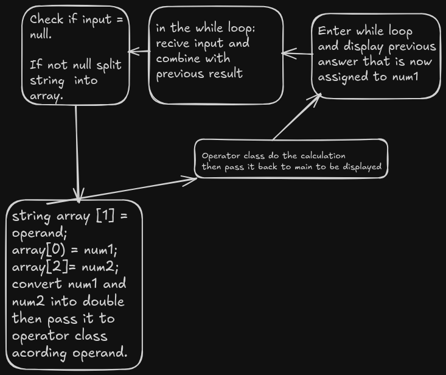

check if input = null

split string into array

check which operator is used using array[1]

Assign array[0] and array[2] to num1 and num2 variable pass it to the calculation class acording to the operator in the array.

display result (maybe using Spectral.Console)

Expansion:

return previous result an asign in to num1 for continous calculations in a while loop.

using List to calculate a string with more than 1 operand.

